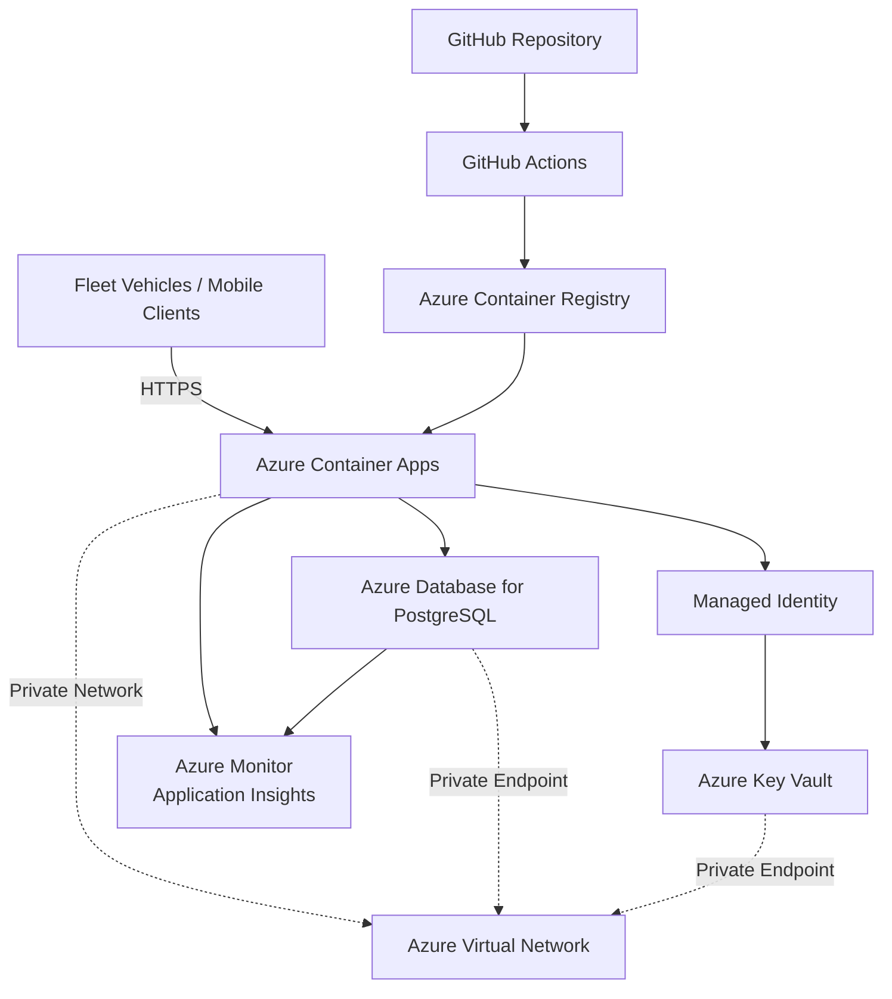

# Azure Architecture Diagram

---

## Component Description

### Fleet Vehicles

Fleet devices send GPS location pings over HTTPS to the application.

### Azure Container Apps

Hosts the Fleet Ping Service.

Responsibilities:

- Process incoming requests
- Authenticate users
- Store fleet telemetry
- Expose Health and Readiness endpoints

### Azure Database for PostgreSQL

Stores:

- Driver information
- Fleet location pings

### Azure Key Vault

Securely stores:

- Database credentials
- JWT secret
- Other application secrets

### Managed Identity

Allows Azure Container Apps to access Key Vault without storing credentials.

### Azure Monitor & Application Insights

Collect:

- Metrics
- Logs
- Alerts
- Performance telemetry

### GitHub Actions

CI/CD pipeline responsible for:

- Build
- Security Scan
- Container Image Creation
- Deployment

### Azure Container Registry (ACR)

Stores Docker images before deployment.

### Azure Virtual Network

Provides secure communication between internal Azure resources.

Publicly Accessible

- Azure Container App Ingress (HTTPS)

Private Components

- Azure Database for PostgreSQL
- Azure Key Vault

Communication between internal services occurs over private networking.